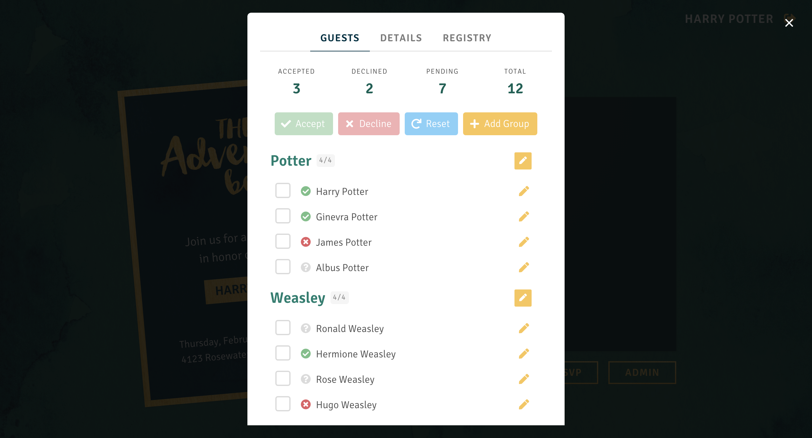

## The Adventure Begins

This full-stack web app was built to replace my traditional baby shower invitations, supplemented by a back-end and database for a guest list, event information repository, RSVP functionality, and admin control.

## Features

* Guests are able to view their invitation on the main page by providing their first name and last name. 
* If they are on the guest list, they will be taken to the invitation with their party's names (along with any additional plus ones allotted to their party).
* Guests are able to view details with event information, any event requests, and the event registry list.
* Guests are able to RSVP by using the checkboxes to accept or decline for each member of their party. They can also edit their name, add plus ones if their party has room, and delete plus ones they created.
* Administrators are able to edit event details, edit the registry list, and manage all guest responses. They can also add more parties and guests to the guest list as well as edit each party's guest count limit for plus ones.

## Screenshots




## Installation

Before starting, make sure the [back-end](https://github.com/vikandagonzales/adventure-backend) is already up and running.
```
$ git clone https://github.com/vikandagonzales/adventure
$ cd adventure
$ npm install
$ npm start
```

## Tools & Technologies

The front-end was built with HTML5, CSS3, Sass, [Bulma](https://bulma.io), JavaScript, [React](https://reactjs.org), [Redux](https://redux.js.org), and Axios. The [back-end](https://github.com/vikandagonzales/adventure-backend) was built with Node.js, Express.js, Knex.js, PostgreSQL.

## Copyright

Copyright &copy; 2019 Vikanda Gonzales.